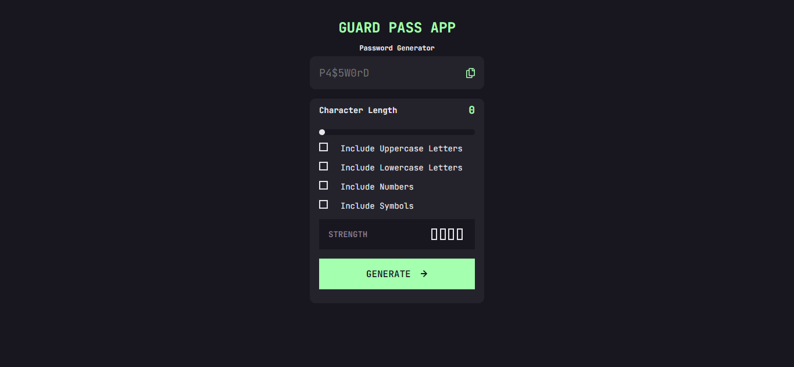
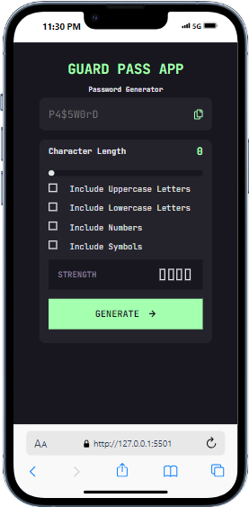

# Frontend Mentor - Password generator app solution

This is a solution to the [Password generator app challenge on Frontend Mentor](https://www.frontendmentor.io/challenges/password-generator-app-Mr8CLycqjh). Frontend Mentor challenges help you improve your coding skills by building realistic projects.

## Table of contents

- [Overview](#overview)
  - [The challenge](#the-challenge)
  - [Screenshot](#screenshot)
  - [Links](#links)
- [My process](#my-process)
  - [Built with](#built-with)
  - [What I learned](#what-i-learned)
  - [Continued development](#continued-development)
  - [Useful resources](#useful-resources)
- [Author](#author)
- [Acknowledgments](#acknowledgments)

## Overview

### The challenge

Users should be able to:

- Generate a password based on the selected inclusion options
- Copy the generated password to the computer's clipboard
- See a strength rating for their generated password
- View the optimal layout for the interface depending on their device's screen size
- See hover and focus states for all interactive elements on the page

### Screenshot

### Links

- Solution URL: [Add solution URL here](https://your-solution-url.com)
- Live Site URL: [Guard Pass APPP](https://guardpasss.netlify.app/)

## My process

### Built with

- Semantic HTML5 markup
- CSS custom properties
- Flexbox
- CSS Grid
- Mobile-first workflow
- JavaScript

### What I learned

- How to use the Math.floor method in JS
- Write a functional logic
- Update the slider value

### Continued development

- Working with Slider and updating the slider value
- Using transition and animation

### Useful resources

- I used so many resources that I forgot to document them.

## Author

- Frontend Mentor - [@Manuelcoder02](https://www.frontendmentor.io/profile/Manuelcoder02)
- Twitter - [juniorDev @sotundenuel](https://www.twitter.com/@sotundenuel)
- Instagram - [@sotundenuel](https://www.instagram.com/sotundenuel)

## Acknowledgments

A big thank you to myself for getting this project done and also Special thanks to [George](https://twitter.com/_Annonnymouss_) for always taking time to review my works.
